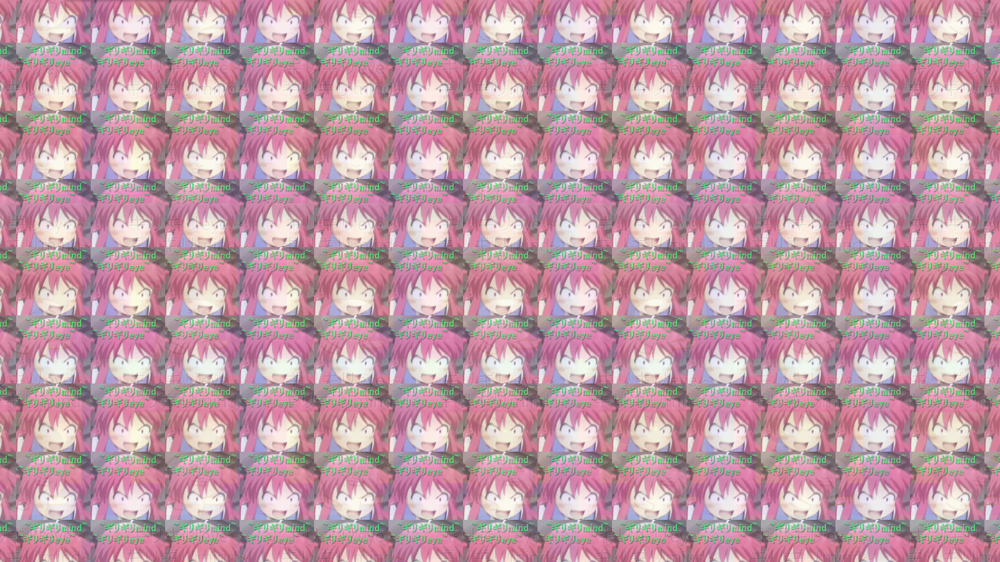

# girigiri

使用 QML 制作的让我再吸一口。

好吧，背景图片来源自 [girigiri.love](http://girigiri.love/)。这个网站的代码比歌曲本身还魔性，中文变量名用到飞起。

这个程序可以在桌面系统下运行。

点击画面进行播放，按下回车全屏，按下 `H` 隐藏播放栏。

其实还是一个普通的播放器，可以打开本地视频或者音频进行播放。不过，还是再上我吸一口吧。

